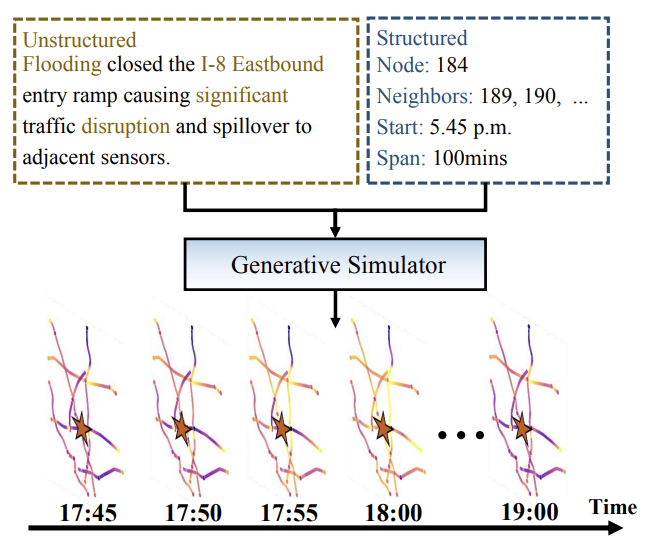
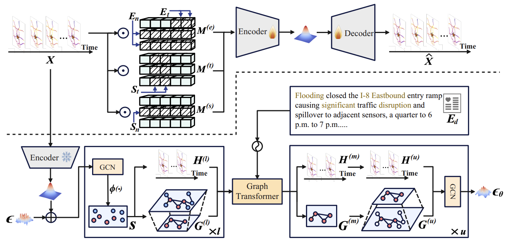
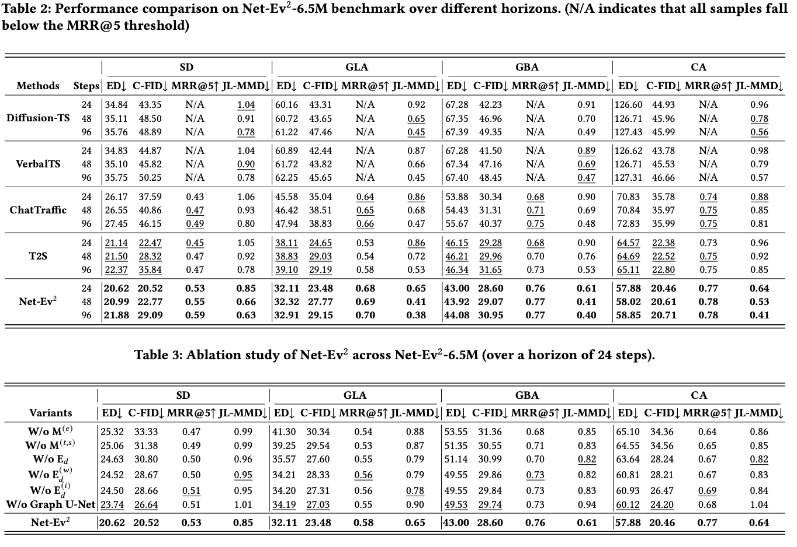

# Net-Ev$^2$: A Generative Simulator for Network Event Evolution

---

## 🎯 New Task: Network Event Evolution Simulation

**Net-Ev$^2$** addresses a novel and challenging problem: **simulating how disturbance events (e.g., accidents, weather) propagate their impacts across real-world networks**. Unlike traditional time series generation, this task requires:

- **Multi-structural event modeling**: Events contain both unstructured text descriptions and structured attributes (node indices, time spans)
- **Topology-aware generation**: Event impacts propagate along network edges, requiring explicit graph structure modeling
- **Flexible inference**: Generate simulations using only natural-language event descriptions at inference time

### Problem Formulation

Given a network graph $G = (V, A)$ and an event $E$ with multi-structural attributes, the task is to simulate realistic future network states that reflect how the event evolves and propagates:

$$E = \{E_d, E_n, E_t\} \xrightarrow{G} \hat{X} \in \mathbb{R}^{T \times N}$$

---

## 🏗️ Architecture

---

## 📊 Main Results

Net-Ev$^2$ achieves state-of-the-art performance across all evaluation metrics on four large-scale road networks, demonstrating superior topology preservation and strong generalization ability.

---

## 🔬 New Evaluation Metric: JL-MMD

We introduce **JL-MMD**, a topology-aware metric based on Johnson-Lindenstrauss lemma for assessing topological fidelity in generated network dynamics. Unlike traditional metrics that are blind to graph structure, JL-MMD uniquely captures how event impacts propagate along network edges.

**Code Location**: 
- Implementation: `jlmetric/metric.py` (JLEvaluator class)
- Usage: `main.py` (compute_mmd function and evaluate function)

---

## 📦 New Benchmark Net-Ev$^2$-6.5M

We introduce **Net-Ev$^2$-6.5M**, a large-scale multimodal benchmark with over **6.5 million** aligned event-traffic pairs:

- **4 Metropolitan Networks**: San Diego (SD), Greater Bay Area (GBA), Greater Los Angeles (GLA), California (CA)
- **Full Dataset Storage**: ~12 TB

| Subset | Total Samples | Incident Events | Weather Events |
|--------|---------------|-----------------|----------------|
| SD | 836,694 | 48,464 | 788,230 |
| GLA | 654,420 | 51,086 | 603,334 |
| GBA | 1,201,201 | 22,639 | 1,178,562 |
| CA | 3,824,877 | 283,395 | 3,541,482 |
| **Total** | **6,517,192** | **405,584** | **6,111,608** |

**Note**: Due to memory limitations, we only upload 1/1000 of the SD dataset (2017) in `Net-Ev-2/Data/SD/2017` for demonstration purposes.

''’
@inproceedings{
2026netev,
title={Net-Ev\${\textasciicircum}2\$: A Generative Simulator for Network Event Evolution},
author={Guangyu Wang and Zhaonan Wang},
booktitle={32nd SIGKDD Conference on Knowledge Discovery and Data Mining, 2026 - Research Track (Second Cycle Deadline)},
year={2026},
url={https://openreview.net/forum?id=xutVnQtlA7}
}
'''

---

## 📄 License

This project is licensed under the MIT License - see the LICENSE file for details.

